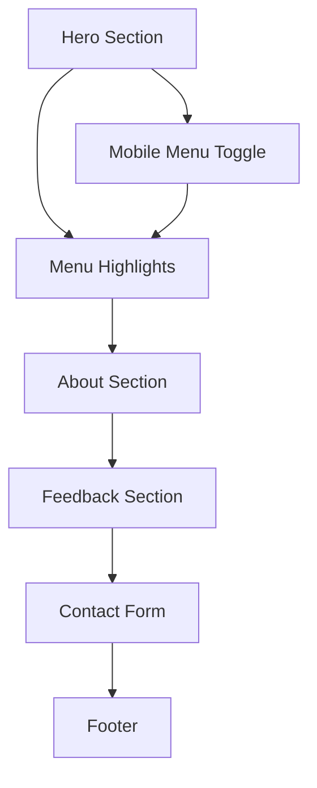

## 1. Product Overview

Blu Coffee Landing Page là một trang web giới thiệu dịch vụ cà phê mang đi dành riêng cho Gen Z, được thiết kế hiện đại và tối ưu trải nghiệm người dùng.

* Mục tiêu: Tạo ra một landing page thu hút, dễ sử dụng để giới thiệu thương hiệu Blu Coffee và khuyến khích khách hàng đặt hàng.

* Đối tượng sử dụng: Gen Z yêu thích cà phê, có nhu cầu đặt hàng mang đi nhanh chóng và tiện lợi.

* Giá trị: Tăng nhận diện thương hiệu và chuyển đổi khách hàng tiềm năng thành khách hàng thực tế.

## 2. Core Features

### 2.1 User Roles

Không cần phân biệt vai trò người dùng - tất cả khách truy cập đều có quyền truy cập đầy đủ vào các tính năng cơ bản.

### 2.2 Feature Module

Landing page Blu Coffee bao gồm các trang chính sau:

1. **Trang chủ**: Header/Navbar, Hero Section, Menu Highlights, About Section, Feedback Section, Contact Form, Footer.

### 2.3 Page Details

| Page Name | Module Name      | Feature description                                                                                                                     |
| --------- | ---------------- | --------------------------------------------------------------------------------------------------------------------------------------- |
| Trang chủ | Header/Navbar    | Hiển thị logo "Blu Coffee", menu điều hướng (Home, Menu, About, Contact), hiệu ứng sticky khi scroll với thay đổi nền                   |
| Trang chủ | Hero Section     | Tiêu đề chính "Cà phê chuẩn gu, chill mọi nơi!", mô tả "Thức uống cho tâm hồn Gen Z bận rộn", nút CTA "Đặt hàng ngay" dẫn đến phần Menu |
| Trang chủ | Menu Highlights  | Hiển thị 3 sản phẩm cà phê nổi bật với ảnh, tên, giá, slogan và giới thiệu chi tiết                                                     |
| Trang chủ | About Section    | Mô tả ngắn về sự khác biệt của Blu Coffee kèm hình ảnh minh họa                                                                         |
| Trang chủ | Feedback Section | Hiển thị 3 phản hồi khách hàng với hiệu ứng slide ngang tự động                                                                         |
| Trang chủ | Contact Form     | Form liên hệ gồm tên, email, tin nhắn với validation và alert cảm ơn khi gửi                                                            |
| Trang chủ | Footer           | Thông tin địa chỉ, giờ mở cửa, liên kết mạng xã hội (Facebook, Instagram, TikTok)                                                       |
| Trang chủ | Mobile Menu      | Menu hamburger cho thiết bị di động với hiệu ứng toggle                                                                                 |
| Trang chủ | Smooth Scroll    | Cuộn mượt khi click vào các mục menu điều hướng                                                                                         |

## 3. Core Process

Quy trình sử dụng chính của khách hàng:

1. Truy cập trang web → Xem Hero Section với thông điệp chính
2. Click "Đặt hàng ngay" → Cuộn xuống phần Menu Highlights
3. Xem các sản phẩm nổi bật → Đọc thông tin About
4. Xem feedback khách hàng → Điền form liên hệ nếu cần
5. Xem thông tin liên hệ tại Footer

## 4. User Interface Design

### 4.1 Design Style

* **Màu sắc chính**: Pastel nâu (#D2B48C), kem (#F5F5DC), trắng (#FFFFFF)

* **Màu sắc phụ**: Nâu đậm (#8B4513) cho text, xám nhạt (#F8F8F8) cho background

* **Kiểu button**: Bo góc mềm mại với hiệu ứng hover glow nhẹ

* **Font chữ**: Google Fonts Poppins (primary) hoặc Montserrat (fallback)

* **Kích thước font**: Heading 2.5rem-3rem, body text 1rem-1.2rem

* **Layout**: Card-based design với navigation top, spacing rộng rãi

* **Icon style**: SVG icons đơn giản, hiện đại cho social media

### 4.2 Page Design Overview

| Page Name | Module Name      | UI Elements                                                                                                   |
| --------- | ---------------- | ------------------------------------------------------------------------------------------------------------- |
| Trang chủ | Header/Navbar    | Fixed position, background trắng trong suốt chuyển thành solid khi scroll, logo bên trái, menu ngang bên phải |
| Trang chủ | Hero Section     | Full-height background gradient, text căn giữa, button CTA nổi bật với màu nâu pastel                         |
| Trang chủ | Menu Highlights  | Grid layout 3 cột, card design với shadow nhẹ, hover effect scale                                             |
| Trang chủ | About Section    | 2-column layout với text bên trái, image bên phải                                                             |
| Trang chủ | Feedback Section | Carousel slider với dots indicator, card design cho testimonials                                              |
| Trang chủ | Contact Form     | Centered form với input styling nhất quán, button submit nổi bật                                              |
| Trang chủ | Footer           | Dark background với text trắng, social icons ngang hàng                                                       |

### 4.3 Responsiveness

Desktop-first approach với mobile-adaptive design:

* Breakpoint chính: 768px cho tablet, 480px cho mobile

* Mobile: Menu hamburger, single column layout, touch-optimized buttons

* Tablet: 2-column grid cho menu highlights, adjusted spacing

* Desktop: Full multi-column layout với hover effects

